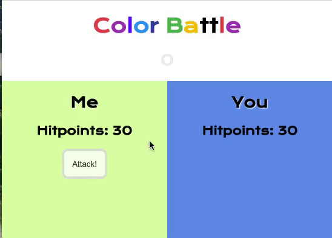
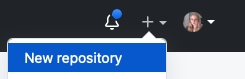
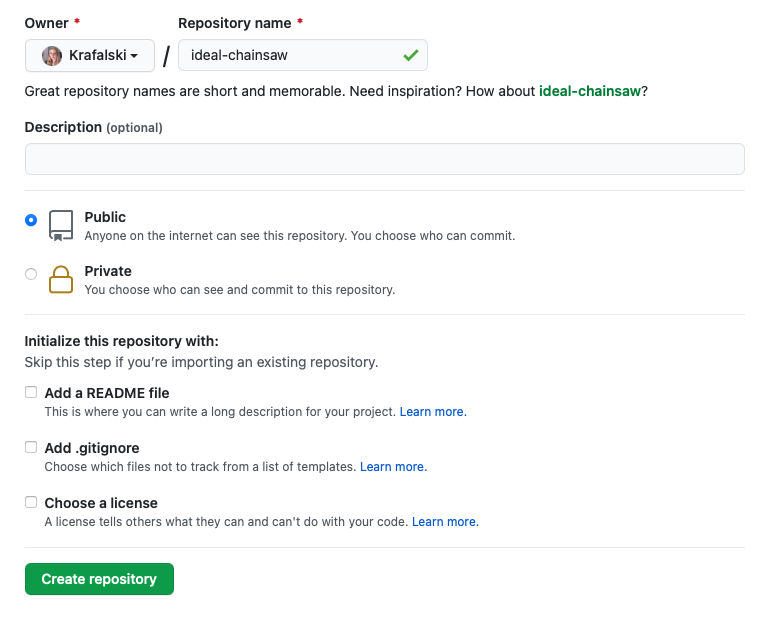
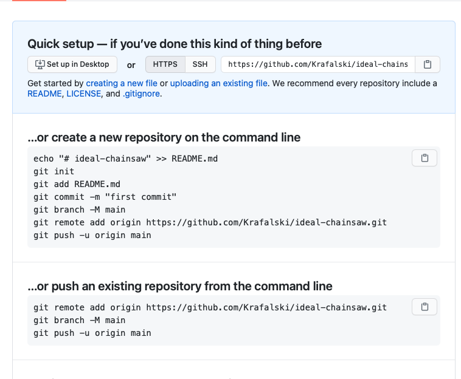
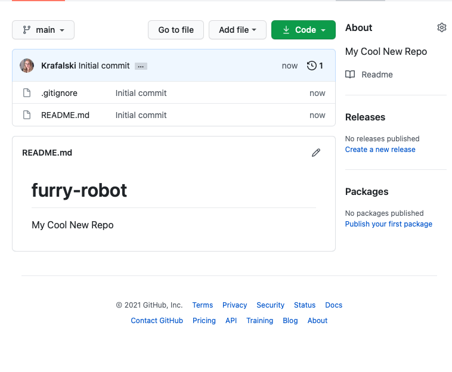
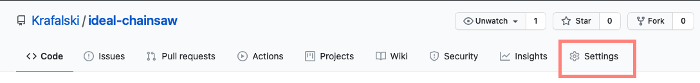
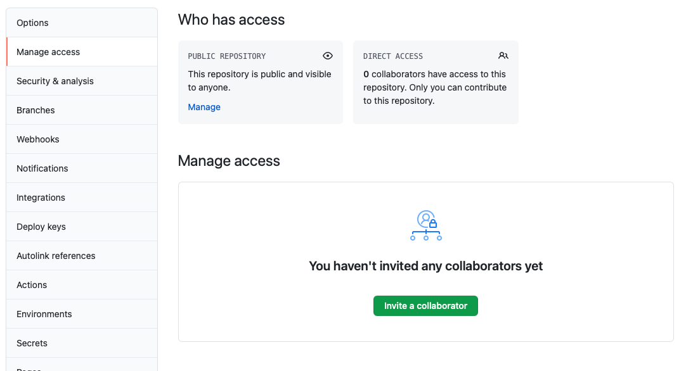
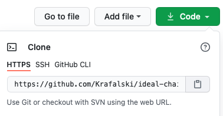

# Color Battle

## Collaborate with a Partner to Create a Color Battle

Today you will work with a partner to create a React application, put it on GitHub, and collaborate with a partner in order to build a simple game of chance.

Each partner will take turns driving and being the passenger.



## Getting Started: Create React App

- Choose one person to be the `owner` of this project. This person will create the repository on their GitHub and then they will add the other person as a `collaborator`.

The owner will start out as the driver

**Owner**

- In Terminal, navigate to your Desktop or other convenient folder
- `git status` to make sure you are not already in a `git` repository
- `npx create-react-app color-battle`
- `cd color-battle`
- `code .` to open this project in your text editor
- `npm start` to load your new react app
- make this app your own

**src/App.js**

```js
import React from "react";

class App extends React.Component {
  render() {
    return (
      <div>
        <header>
          <h1>Color Battle</h1>
        </header>
      </div>
    );
  }
}

export default App;
```

Check that your app still works in the browser. Once it is set, put it on GitHub.

## Getting Started: GitHub

**Owner**

- Go to [GitHub](https://github.com) and click `New Repository` from the nav bar



- Name the repo and select a name for your repo



**IMPORTANT!** Do NOT add a `README` file, `.gitignore`, or license. When you create a new `create-react-app`, all these will be created for you.

<details><summary>SUCCESS</summary>



</details>

<details><summary>TRY AGAIN</summary>



</details>

- Go to the second section
  `…or push an existing repository from the command line`

- Copy the terminal commands and go back to terminal
- Use <kbd>⌘</kbd> <kbd>t</kbd> to open a new tab in terminal, while leaving your react development server running
- `git add .`
- `git commit -m 'first commit'`
- In the new tab, paste your code from your clipboard. This will:
  - Add the remote location of your github repo to this project
  - It will also name the main branch of your project `main`
  - Finally, it will push your project to GitHub
- Refresh your browser to check that you now see your React project files in your GitHub repo

- Go to the `Settings` tab



- Choose `Manage Access` From the left menu
- Find the green button that says `Invite a collaborator`



- Ask your teammate for their GitHub username and enter it
- Your teammate should get an email invitation to collaborate

## Switch! Collaborator is now the Driver

- Accept your invite to collaborate and navigate to the GitHub repository

- In Terminal, navigate to your Desktop or other convenient folder
- git status to make sure you are not already in a git repository
- In GitHub, use the green code button to copy the repository's URL



**Back in terminal**

- `git clone <Copied GitHub URL>`
- `cd color-battle` (or whatever this repo is named, you can type`ls` to check)
- `npm install`
- `npm start`
- Let the development server start and you should see your app in the browser now
- In the app component, add the constructor function and add state

## Make a branch

Practice using git branches for collaboration. Since this is a simple, short and practice build, it is ok to just name the branch you work on after yourself.

Be sure to switch driver/passenger often. Your work flow should be similar to:

- Work on your branch
- Push up your changes
- Make a pull request on github
- Have your partner review and merge it into main
- Your partner should then `pull` the changes to their computer
- Your partner should now work on the next feature/functionality and repeat the process

It is ok to make mistakes and work on the wrong branch. Do your best to troubleshoot and find solutions. The more you practice, the better you'll understand how to use git branches for collaboration.

**Everyone**

- `git checkout -b myName`

## Hints

These hints are optional, try to work as a team to solve each problem on your own.

## Make Your Components

[The React documentation](https://reactjs.org/docs/thinking-in-react.html) recommends starting with a mockup and then breaking up your app into components. Do you have any components you'd like to use more than once?

Then, build a static version (no state yet). It's ok to hardcode values so you can get a good visual of your app. Later, you will replace these values with state/props.

Add a tiny bit of CSS so that it is easy to see your app/components as you build. Time block ~10 minutes.

[Determine where state should go.](https://reactjs.org/docs/thinking-in-react.html#step-4-identify-where-your-state-should-live)

## Example State

- For this app you need
- Player info
  - player name
  - player color
  - player hitpoints
- The value of the dice (die)
- A way to track whose turn it is

Can you think of anything else to track?

**Simple State**

If you feel don't feel confident with state/updating state yet, start with the following:

```js
this.state = {
  p1Name: "me",
  p1Color: "orchid",
  p1HitPoints: "100",
  p2Name: "you",
  p2Color: "cornflowerblue",
  p2HitPoints: "100",
  dice: 0,
  myTurn: true,
};
```

**Challenging State**

If you want to challenge yourself and do some research on how to update state with nested objects - use the following:

```js
this.state = {
  player1: {
    name: "Me",
    color: "orchid",
    hitpoints: 100,
    turn: true,
  },
  player2: {
    name: "You",
    color: "cornflowerblue",
    hitpoints: 100,
    turn: false,
  },
  dice: 0,
  myTurn: true,
};
```

## Render Your State

- Take the time to replace anything you hardcoded that should be state/props.

## Add Game Logic

- What kind of logic does your game need?
- A way to roll the dice(die) on button click
- What happens when the dice(die) is rolled?
  - Whose turn is it? How can you make it clear in the UI/Browser?
  - How do you affect the hit points of the opponent?
  - How do you change turns?
  - How does one win (hit points under 0 for one player?)
  - Other considerations?

Start by solving one problem at a time. If you can't figure out how to do something, try to break it into smaller steps.

For example, if you don't know how to 'roll the dice(die)', how about just using `console.log()` to print a string to check that the `onClick` works?

- Research how to get a random value between 1-6, then when you click the button, replace the string with the newly generated random number
- Next, what do you do with the number? Whose hitpoints would you subtract from?
- How do you access the hitpoints from the players?
- How would you update state so that the hitpoints update on the page and not just showing up as a `console.log`?
- How would you check if this latest turn caused a win? For the purposes of developing this logic, you can change the hitpoints to 10, so the rounds go much faster. To start a new game, just refresh the page for now

## Bonuses

By now your game is great! But you can make it awesome! Here are some ideas:

- Add more style, perhaps make the dice(die) look more like a real world die
- Randomize who goes first
- Add a second die
- Add a play again button, so players don't have to refresh the page
- Add a heal button, so that instead of just being able to attack, the player can choose to heal themselves instead
- Add a modal that pops up with a nice win message
  - Use the giphy API to display a random gif in the winning API
- Let players enter their username and color on game start
- Add a way to track how many wins each player has
- Make a health bar that represents the remaining hitpoints that shrinks as hitpoints go down
- Add a third player! Let the player choose whether they want to attack one other player, or split their attack across the other players or heal themselves

## Bonus Bonus

If you've taken your color-battle game as far as you want and you still have time leftover, try making a new game!

Switch who is the owner and who is the collaborator in the project

A game like Tic Tac Toe or a word-guessing game are small enough in scope to build a basic version in a reasonable amount of time.
